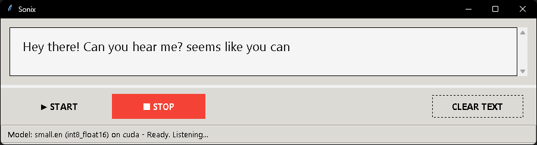

# Sonix Transcriber


A high-performance, real-time desktop transcription application powered by `faster-whisper`. Sonix is designed for speed, leveraging GPU acceleration (CUDA) to provide near-instantaneous speech-to-text conversion directly on your machine.

---

### Demo

*This is a short GIF demonstrating the real-time transcription in action.*


## Key Features

-   **Real-Time Transcription**: See your speech converted to text almost instantly.
-   **GPU Accelerated**: Utilizes NVIDIA CUDA via PyTorch and `faster-whisper` for maximum performance.
-   **High Performance**: Tuned for speed with `int8` quantization and optimized streaming logic.
-   **Voice Activity Detection (VAD)**: Intelligently filters out silence to improve accuracy and responsiveness.
-   **Easily Configurable**: Tweak model size, performance settings, and streaming behavior in a single `config.py` file.
-   **Modular Codebase**: A clean, multi-file structure makes the project easy to understand, maintain, and extend.
-   **Simple GUI**: A clean and straightforward user interface built with Python's native Tkinter library.

## Main Interface



## Tech Stack

-   **Core Engine**: [faster-whisper](https://github.com/guillaumekln/faster-whisper)
-   **Python**: 3.9+
-   **GPU Backend**: [PyTorch](https://pytorch.org/) (CUDA enabled)
-   **Audio Input**: [sounddevice](https://python-sounddevice.readthedocs.io/)
-   **GUI**: [Tkinter](https://docs.python.org/3/library/tkinter.html) (standard Python library)
-   **Numerical Processing**: [NumPy](https://numpy.org/)

## Installation

Follow these steps carefully to get Sonix running on your local machine.

### 1. Prerequisites

-   **An NVIDIA GPU**: This application is built for CUDA acceleration.
-   **NVIDIA CUDA Toolkit**: You must have the CUDA Toolkit installed. The application was tested with version **12.x**. You can download it from the [NVIDIA Developer website](https://developer.nvidia.com/cuda-toolkit-archive).

### 2. Clone the Repository

Open your terminal and clone this repository:
```bash
git clone https://github.com/Eng-M-Abdrabbou/Sonix.git

cd Sonix
```

3. Set Up a Python Virtual Environment

It is highly recommended to use a virtual environment to manage dependencies.

Generated bash
# Create the virtual environment
python -m venv venv

# Activate it
# On Windows:
venv\Scripts\activate
# On macOS/Linux:
source venv/bin/activate

### 4. Install Dependencies

First, create a file named requirements.txt in the project root and paste the following content into it:

```bash
numpy
sounddevice
faster-whisper
```

Now, install PyTorch with CUDA support. This is the most critical step. Go to the Official PyTorch Website and select the correct command for your system (e.g., Stable, Windows, Pip, Python, CUDA 12.1).

The command will look something like this:
```bash
pip install torch torchvision torchaudio --index-url https://download.pytorch.org/whl/cu121
```

### 5. Install Dependencies

First, create a file named requirements.txt in the project root and paste the following content into it:

```bash
numpy
sounddevice
faster-whisper
```

Now, install PyTorch with CUDA support. This is the most critical step. Go to the Official PyTorch Website and select the correct command for your system (e.g., Stable, Windows, Pip, Python, CUDA 12.1).

The command will look something like this:

```bash
pip install torch torchvision torchaudio --index-url https://download.pytorch.org/whl/cu121
```

After installing PyTorch, install the remaining dependencies from the requirements.txt file:

```bash
pip install -r requirements.txt
```

### 6. Run the Application

Once all dependencies are installed, you can run the application with a single command:

```bash
python main.py
```

The application window will appear.

▶ START: Click to begin capturing audio and transcribing.

■ STOP: Click to halt the transcription process.

CLEAR TEXT: Click to wipe all text from the display area.

### 7. Configuration

One of the main advantages of Sonix is its simple configuration. All major settings are located in config.py.

```python
# config.py
```

### 8. Usage

Once all dependencies are installed, you can run the application with a single command:

```bash
python main.py
```

The application window will appear.

▶ START: Click to begin capturing audio and transcribing.

■ STOP: Click to halt the transcription process.

CLEAR TEXT: Click to wipe all text from the display area.

Configuration

One of the main advantages of Sonix is its simple configuration. All major settings are located in config.py.

Generated python
# config.py

#### --- Model Configuration ---
MODEL_SIZE = "small.en"        # tiny.en, base.en, small.en, medium.en
COMPUTE_TYPE = "int8_float16"  # float16, int8_float16, int8 (fastest)
INITIAL_DEVICE = "cuda"

#### --- Manual Streaming Configuration ---
##### How many seconds of audio to process at a time.
##### Smaller value = more responsive, Larger value = better context.
CHUNK_DURATION_S = 2.0

#### --- Transcription Settings ---
LANGUAGE = "en"
BEAM_SIZE = 1                  # 1 is greedy decoding (fastest). >1 is slower but may be more accurate.

#### --- VAD (Voice Activity Detection) Parameters ---
VAD_PARAMETERS = dict(...)

### 9. Project Structure

The codebase is organized into logical modules for better readability and maintainability.
```
Sonix-Transcriber/
├── config.py               # All user-configurable settings.
├── transcription_engine.py   # Core logic for audio processing and transcription.
├── gui.py                  # All Tkinter UI components and layout.
├── utils.py                # Helper functions (CUDA path fix, device init).
├── main.py                 # The main entry point to launch the application.
├── README.md               # You are here!
└── requirements.txt        # Project dependencies.
```

### 10. License

This project is licensed under the MIT License. See the LICENSE file for details.